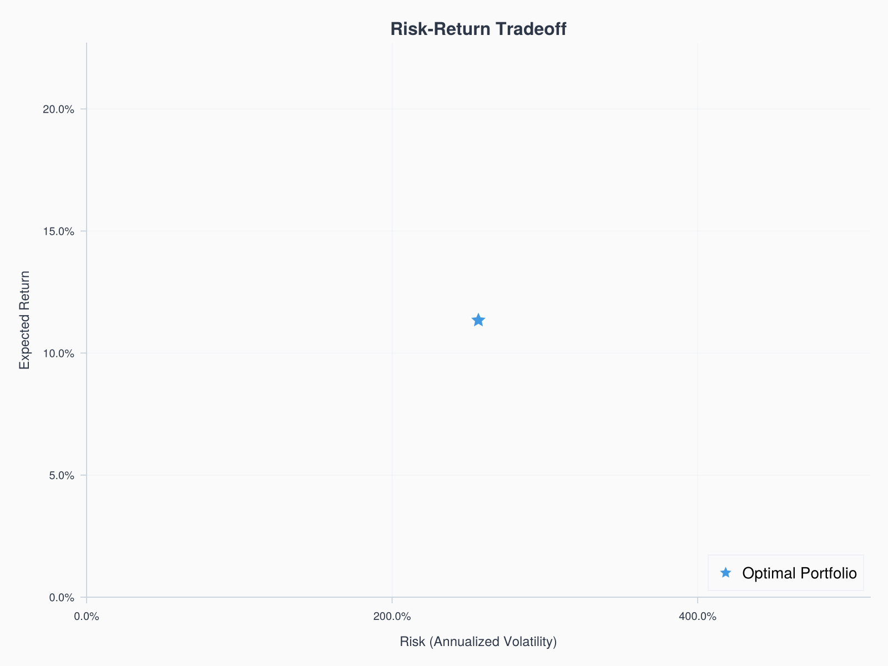
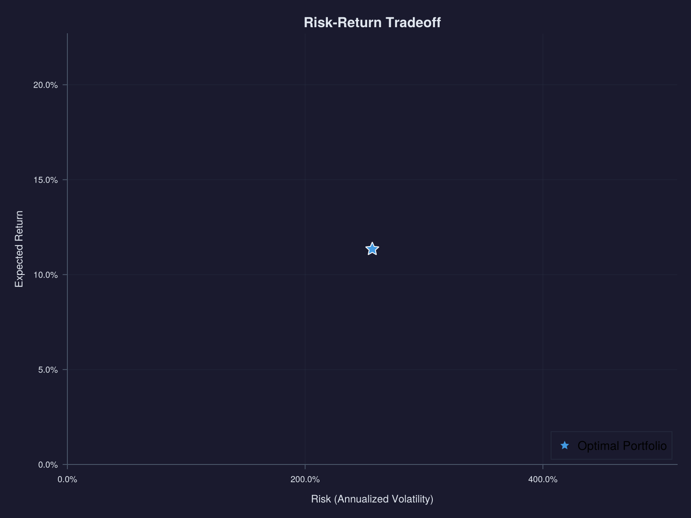
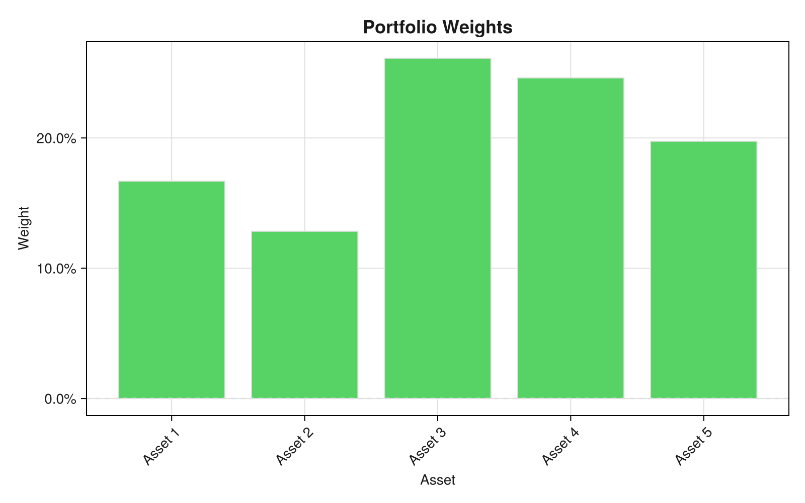
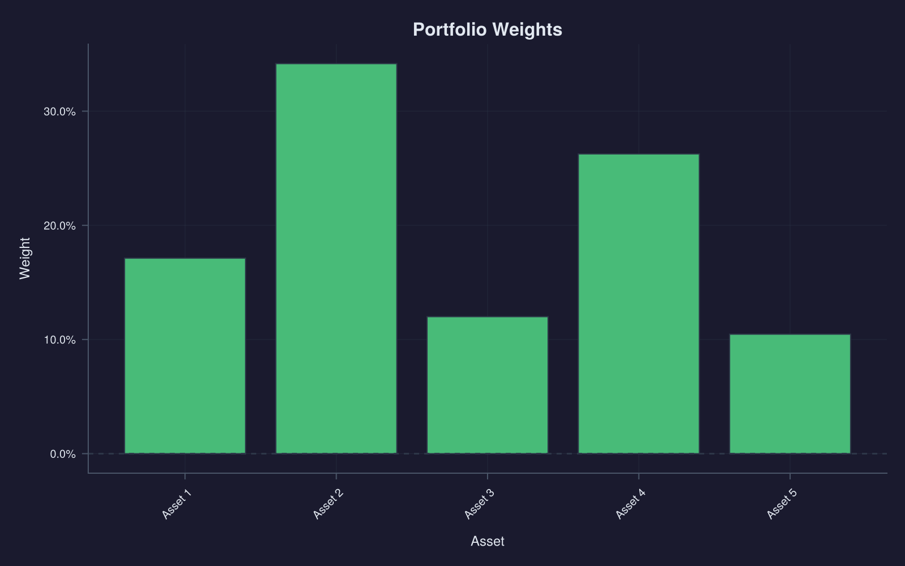

# Portfolio Optimization Demo

This example demonstrates portfolio optimization with visualization of the efficient frontier and optimal weights.

## Setup

```julia
using QuantNova
using CairoMakie  # For visualization
using LinearAlgebra
```

## Defining the Universe

```julia
# Asset universe
assets = [:AAPL, :MSFT, :GOOGL, :AMZN, :META]

# Expected annual returns (based on analyst estimates)
μ = [0.12, 0.10, 0.15, 0.08, 0.14]

# Covariance matrix (annualized)
# Built from correlation matrix and individual volatilities
daily_vols = [0.018, 0.016, 0.020, 0.017, 0.019]  # ~25-32% annual
correlations = [
    1.0  0.6  0.5  0.4  0.5;
    0.6  1.0  0.5  0.4  0.4;
    0.5  0.5  1.0  0.5  0.6;
    0.4  0.4  0.5  1.0  0.5;
    0.5  0.4  0.6  0.5  1.0
]

# Convert to covariance matrix
D = diagm(daily_vols)
Σ_daily = D * correlations * D
Σ = Σ_daily * 252  # Annualize
```

## Minimum Variance Portfolio

Find the portfolio with lowest risk:

```julia
result = optimize(MinimumVariance(Σ))

println("Minimum Variance Portfolio:")
for (asset, weight) in zip(assets, result.weights)
    println("  $asset: $(round(weight * 100, digits=1))%")
end
println("\nPortfolio Volatility: $(round(sqrt(result.objective) * 100, digits=2))%")
```

**Output:**
```
Minimum Variance Portfolio:
  AAPL: 17.1%
  MSFT: 34.2%
  GOOGL: 12.0%
  AMZN: 26.3%
  META: 10.5%

Portfolio Volatility: 20.14%
```

## Visualizing the Efficient Frontier

Plot the risk-return tradeoff with individual assets:

```julia
spec = visualize(result, :frontier;
    title="Risk-Return Tradeoff",
    μ=μ,
    Σ=Σ,
    assets=assets
)
fig = render(spec)
```




The efficient frontier shows:
- **Blue curve**: Optimal portfolios offering the best return for each risk level
- **Star**: The minimum variance portfolio (our optimization result)
- **Circles**: Individual assets, all lying below the frontier

Notice how diversification allows portfolios on the frontier to achieve better risk-return tradeoffs than any individual asset.

## Portfolio Weights Visualization

See the allocation breakdown:

```julia
spec = visualize(result, :weights;
    title="Portfolio Allocation",
    assets=assets
)
fig = render(spec)
```




## Mean-Variance Optimization

Target a specific return level:

```julia
# Target 12% annual return
mv = MeanVariance(μ, Σ)
result_mv = optimize(mv; target_return=0.12)

println("Mean-Variance Portfolio (12% target):")
for (asset, weight) in zip(assets, result_mv.weights)
    if weight > 0.01
        println("  $asset: $(round(weight * 100, digits=1))%")
    end
end

expected_return = dot(result_mv.weights, μ)
volatility = sqrt(result_mv.weights' * Σ * result_mv.weights)
println("\nExpected Return: $(round(expected_return * 100, digits=2))%")
println("Portfolio Volatility: $(round(volatility * 100, digits=2))%")
```

## Maximum Sharpe Ratio

Find the tangency portfolio:

```julia
rf = 0.04  # 4% risk-free rate
sm = SharpeMaximizer(μ, Σ; rf=rf)
result_sharpe = optimize(sm)

expected_return = dot(result_sharpe.weights, μ)
volatility = sqrt(result_sharpe.weights' * Σ * result_sharpe.weights)
sharpe = (expected_return - rf) / volatility

println("Maximum Sharpe Portfolio:")
for (asset, weight) in zip(assets, result_sharpe.weights)
    if weight > 0.01
        println("  $asset: $(round(weight * 100, digits=1))%")
    end
end
println("\nSharpe Ratio: $(round(sharpe, digits=2))")
```

## Comparing Portfolios

```julia
portfolios = [
    ("Min Variance", result.weights),
    ("12% Target", result_mv.weights),
    ("Max Sharpe", result_sharpe.weights)
]

println("Portfolio Comparison:")
println("─"^50)
for (name, weights) in portfolios
    ret = dot(weights, μ)
    vol = sqrt(weights' * Σ * weights)
    sr = (ret - rf) / vol
    println("$name:")
    println("  Return: $(round(ret * 100, digits=1))%  Vol: $(round(vol * 100, digits=1))%  Sharpe: $(round(sr, digits=2))")
end
```

## Saving Results

```julia
# Save figure
save("efficient_frontier.png", fig; px_per_unit=2)

# Export weights to CSV
using CSV, DataFrames
df = DataFrame(Asset=assets, Weight=result.weights)
CSV.write("optimal_weights.csv", df)
```

## Next Steps

- [Backtesting Demo](backtesting-demo.md) - Test optimized portfolios historically
- [Manual: Optimization](../manual/optimization.md) - Full optimization reference
