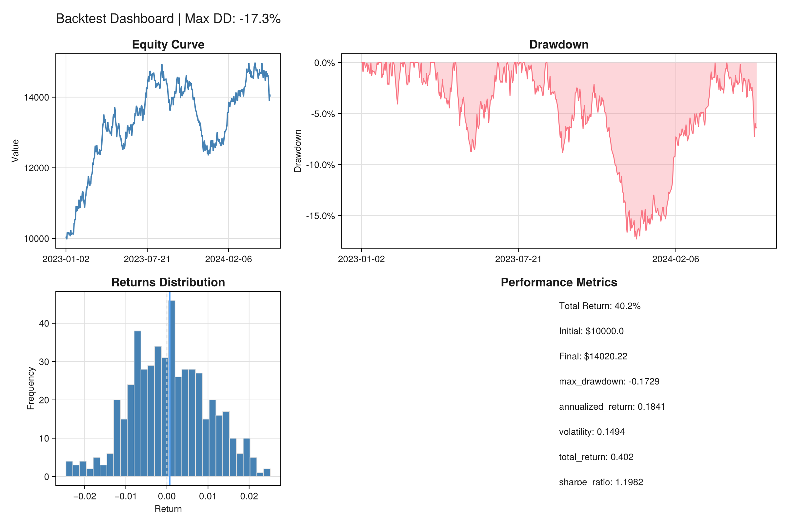
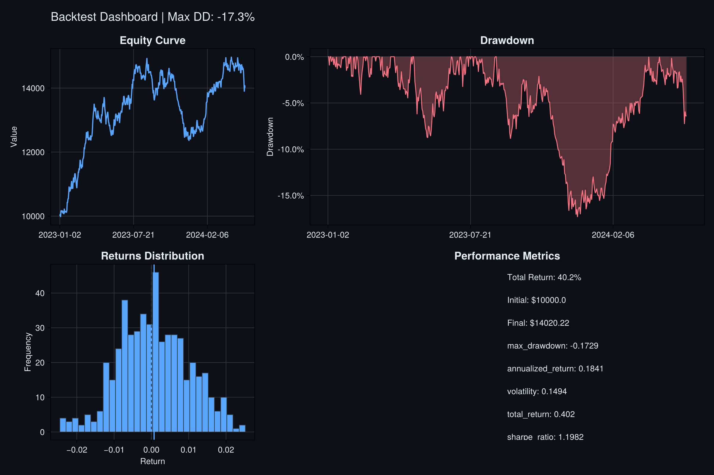
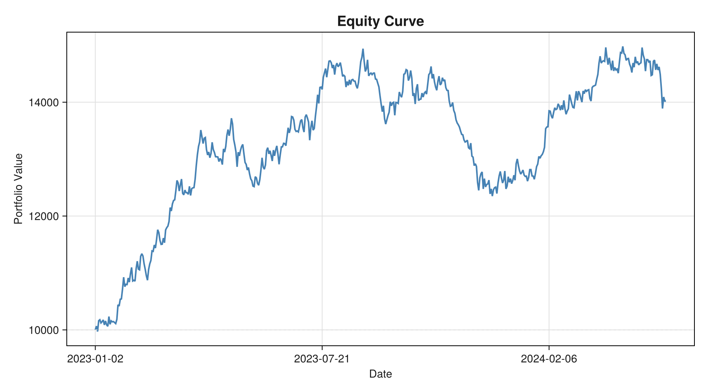
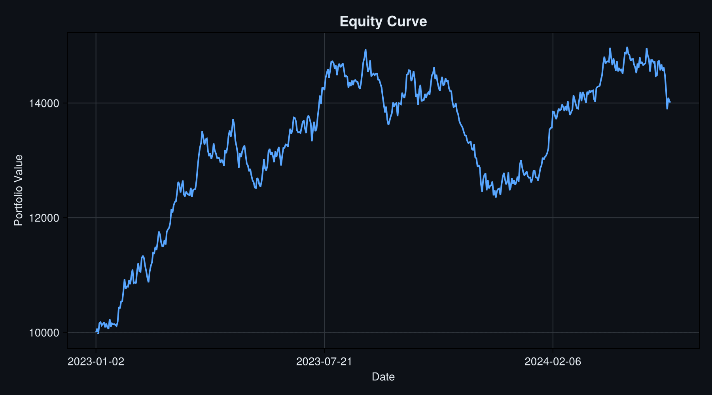
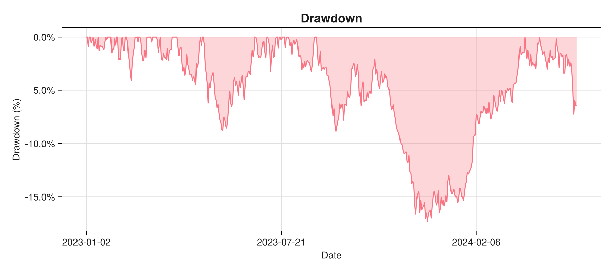
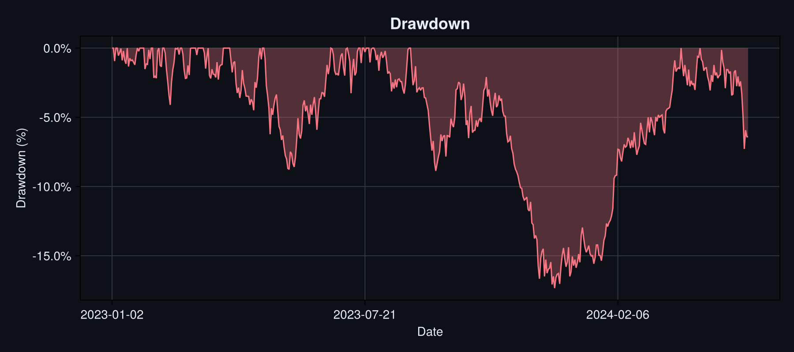
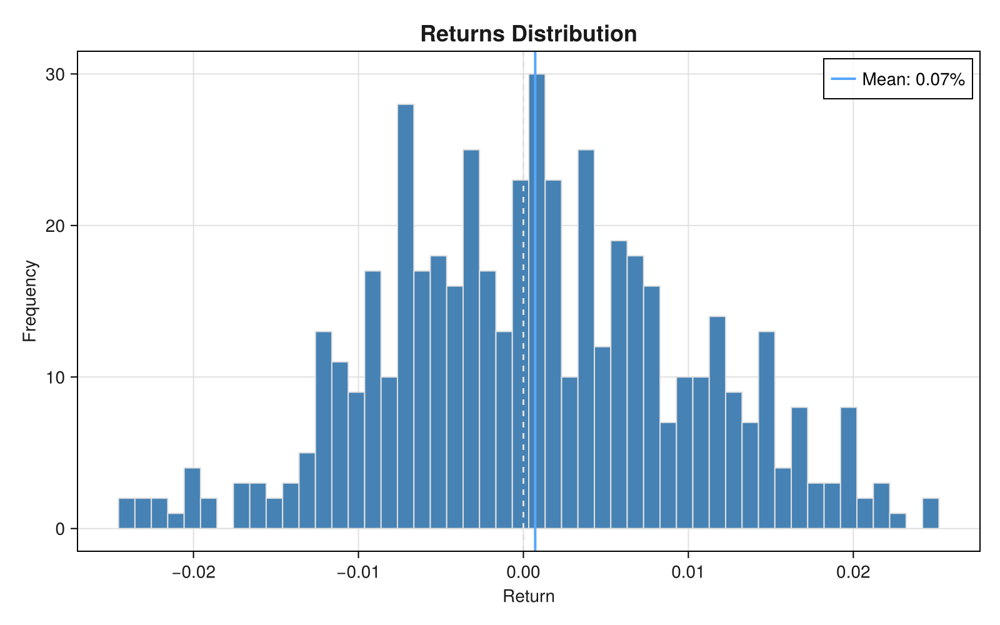
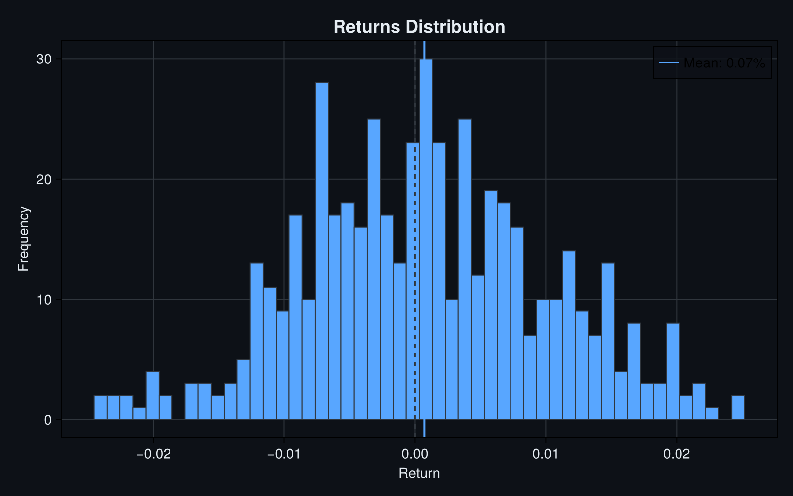
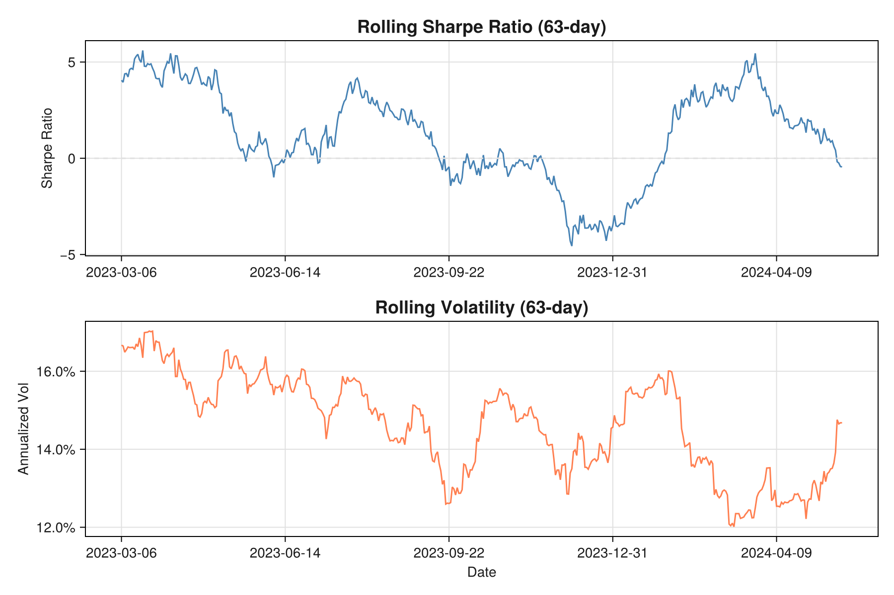
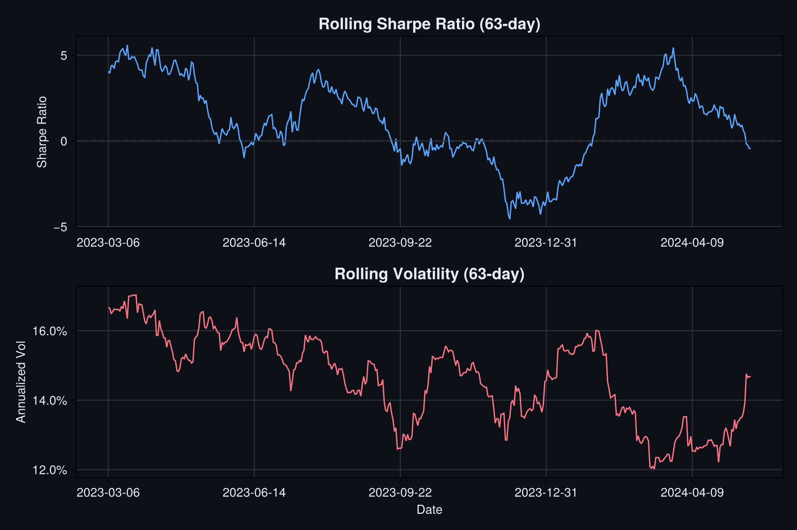

# Backtesting

Run historical backtests with customizable strategies.




## Quick Start

```julia
using QuantNova
using Dates

# Define strategy
strategy = BuyAndHoldStrategy(Dict(:AAPL => 0.6, :GOOGL => 0.4))

# Historical data
timestamps = [DateTime(2024, 1, i) for i in 1:252]
prices = Dict(
    :AAPL => rand(150:0.1:160, 252),
    :GOOGL => rand(140:0.1:150, 252)
)

# Run backtest
result = backtest(strategy, timestamps, prices; initial_cash=100_000.0)

# Analyze results
println("Total Return: $(result.metrics[:total_return] * 100)%")
println("Sharpe Ratio: $(result.metrics[:sharpe_ratio])")
println("Max Drawdown: $(result.metrics[:max_drawdown] * 100)%")
```

## Built-in Strategies

### BuyAndHoldStrategy

Invest once in target weights and hold:

```julia
strategy = BuyAndHoldStrategy(Dict(:SPY => 0.6, :AGG => 0.4))
```

### RebalancingStrategy

Periodically rebalance to target weights:

```julia
strategy = RebalancingStrategy(
    target_weights=Dict(:SPY => 0.6, :AGG => 0.4),
    rebalance_frequency=:monthly,
    tolerance=0.05
)
```

## Custom Strategies

Implement `generate_orders(strategy, state)`:

```julia
struct MomentumStrategy <: AbstractStrategy
    lookback::Int
    # ... fields
end

function QuantNova.generate_orders(s::MomentumStrategy, state::SimulationState)
    # Your logic here
    return orders
end
```

## Visualization

QuantNova provides built-in visualization for backtest results using Makie.jl.

### Equity Curve




```julia
using CairoMakie  # or GLMakie for interactive plots

spec = visualize(result, :equity; title="Portfolio Value")
fig = render(spec)
```

### Drawdown




```julia
spec = visualize(result, :drawdown; title="Drawdown Analysis")
fig = render(spec)
```

### Returns Distribution




```julia
spec = visualize(result, :returns; title="Daily Returns")
fig = render(spec)
```

### Rolling Metrics




```julia
spec = visualize(result, :rolling; title="Rolling Performance", window=63)
fig = render(spec)
```

For a complete walkthrough with all visualization types, see the [Backtesting Demo](../examples/backtesting-demo.md).
